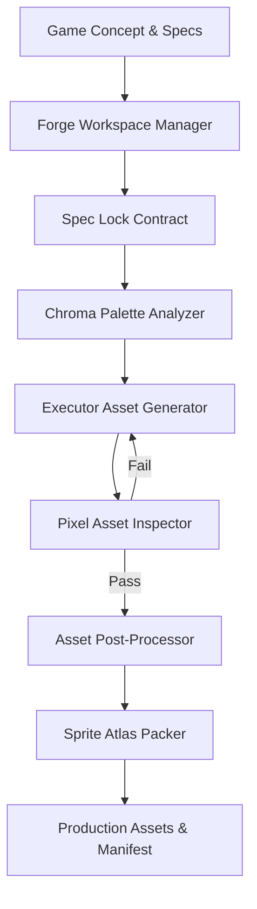

# PixelForge Studio

<div align="center">


[](LICENSE)
[](https://python.org)
[](CHANGELOG.md)

**Next-Generation Autonomous 2D Pixel Art & Sprite Synthesis Engine**

[Quickstart](#quickstart) • [Architecture](#architecture) • [CLI Reference](#cli-reference) • [Skill Setup](#ai-agent-skill-setup) • [Changelog](CHANGELOG.md)

---

</div>

## Overview

**PixelForge Studio** is an enterprise-grade, autonomous 2D pixel art synthesis engine and AI skill workflow. Designed for game developers, indie creators, and AI agents, PixelForge Studio automates the full production lifecycle of 2D game assets—from initial design specs to palette-constrained sprite rendering, quality inspection, stray pixel cleanup, and sprite sheet atlas packing.

### Key Features

- 🎨 **Chroma Palette Synthesis Engine**: Extract, analyze, and enforce strict Euclidean color palettes across sprite sheets and tilesets.
- 📐 **Contract-Driven Generation (`spec_lock.md`)**: Prevents AI drift by locking canvas resolutions, color budgets, and art direction rules before rendering.
- 🧱 **Seamless Terrain & Tile Generator**: Advanced Voronoi cell partitioning, 2-octave noise, and edge-wrapping algorithm standards for seamless 2D tile maps.
- 📦 **Atlas Packer (`atlas_packer.py`)**: Automatically packs individual frame PNGs into optimized sprite sheet atlases paired with standard JSON metadata manifests.
- 🧹 **Post-Processing Suite (`post_processor.py`)**: Color quantization, isolated orphan pixel cleaning, and indexed 8-bit PNG conversion.
- 🤖 **Agentic Skill Integration (`skills/pixelforge-studio`)**: Plug-and-play skill directory compatible with AI agent environments.

---

## Architecture

PixelForge Studio operates as a deterministic, multi-stage synthesis pipeline:



---

## Installation

### Prerequisites

- **Python**: `3.10` or higher
- **Pillow**: `Pillow >= 10.0.0`
- **NumPy**: `numpy >= 1.24.0`

### Setup

```bash
# 1. Clone the repository
git clone https://github.com/your-username/pixelforge-studio.git
cd pixelforge-studio

# 2. Set up virtual environment
python3 -m venv venv
source venv/bin/activate  # On Windows: venv\Scripts\activate

# 3. Install dependencies
pip install -r skills/pixelforge-studio/requirements.txt
```

---

## Quickstart

### 1. Initialize a Workspace Project

Initialize a new asset project with a target resolution of `64x64` and the `SNES Retro` palette:

```bash
python3 skills/pixelforge-studio/scripts/forge_workspace.py init retro_hero --size 64x64 --palette default
```

This creates a structured workspace folder under `projects/retro_hero_64x64_<date>/` with predefined asset subdirectories (`characters`, `tiles`, `items`, `ui`, `effects`, `backgrounds`).

### 2. Analyze & Validate Palettes

Extract dominant palette colors from reference images:

```bash
python3 skills/pixelforge-studio/scripts/chroma_analyzer.py extract reference.png --count 16
```

Validate workspace assets against declared palette contracts:

```bash
python3 skills/pixelforge-studio/scripts/chroma_analyzer.py validate projects/retro_hero_64x64_20260722
```

### 3. Audit Asset Quality

Inspect synthesized assets for contract breaches, canvas size mismatches, and anti-aliasing artifacts:

```bash
python3 skills/pixelforge-studio/scripts/asset_inspector.py projects/retro_hero_64x64_20260722
```

### 4. Run Post-Processing Suite

Quantize colors, remove stray orphan pixels, and convert RGBA PNGs to indexed color:

```bash
python3 skills/pixelforge-studio/scripts/post_processor.py projects/retro_hero_64x64_20260722 --all
```

### 5. Pack Sprite Atlases

Assemble individual PNG frames into sprite sheet atlases:

```bash
python3 skills/pixelforge-studio/scripts/atlas_packer.py projects/retro_hero_64x64_20260722 --by-category
```

---

## CLI Reference

| Tool Command | Script Path | Main Arguments | Description |
|--------------|-------------|----------------|-------------|
| `forge_workspace` | `scripts/forge_workspace.py` | `init`, `import-sources`, `validate` | Initializes project workspaces and validates structural integrity. |
| `chroma_analyzer` | `scripts/chroma_analyzer.py` | `extract`, `validate`, `distance` | Color extraction, palette verification, Euclidean distance calculations. |
| `asset_inspector` | `scripts/asset_inspector.py` | `<project_path>` | Quality inspector testing for palette compliance and hard edges. |
| `atlas_packer` | `scripts/atlas_packer.py` | `<project_path> [--by-category]` | Packs sprite sheets and outputs `manifest.json`. |
| `post_processor` | `scripts/post_processor.py` | `<project_path> [--all]` | Quantizes colors, cleans stray pixels, and converts to indexed PNG. |

---

## AI Agent Skill Setup

To integrate **PixelForge Studio** into your AI agent environment (Gemini / Antigravity / Claude / Cursor):

1. Point your agent customization or skill path to `skills/pixelforge-studio`.
2. The agent will read `SKILL.md` to trigger the `pixelforge-studio` synthesis workflow when requested to create pixel art, tilesets, or game sprites.

---

## Web Showcase Interface

Open [`index.html`](file:///Users/ervareza/CODE/agent-skill-pixel-art/index.html) in any modern browser to view the interactive web showcase, live workflow preview, interactive CLI docs, and real-time project changelog.

---

## License

This project is licensed under the **MIT License** - see the [LICENSE](LICENSE) file for details.
