# 🎮 Pixel Art — AI Agent Skill

An AI agent skill for creating, auditing, exporting, and managing 2D pixel art game assets.

**13 CLI tools** · **11 palettes** · **3 interactive templates** · **7 reference guides**

Compatible with **Antigravity IDE**, **Claude Code**, **Codex CLI**, and any agent that supports the skills folder convention.

---

## What This Is

This is a **skill** — a folder of instructions, scripts, palettes, and reference documents that AI agents load dynamically to become expert pixel art assistants. When installed, your AI agent can:

- Create game-ready sprites, tilesets, character walk cycles, UI elements, and particle effects
- Enforce strict pixel art rules (no anti-aliasing, palette limits, grid alignment)
- Audit existing pixel art for quality issues and fix them
- Pack sprite frames into atlas sheets with JSON metadata for game engines
- Remap colors to target palettes (PICO-8, GameBoy, NES, SNES, CGA, etc.)
- Export animated GIFs, resize with nearest-neighbor, add outlines
- Generate procedural noise textures and dithered gradients

---

## Installation

### Antigravity IDE (Google Gemini)

```bash
cp -r skills/pixel-art ~/.gemini/config/skills/pixel-art
```

Or add to your workspace `.agents/skills/` directory:

```bash
cp -r skills/pixel-art .agents/skills/pixel-art
```

### Claude Code

```bash
# Using the built-in skills command
claude skills add ./skills/pixel-art

# Or manual install
cp -r skills/pixel-art ~/.claude/skills/pixel-art
```

### Codex CLI (OpenAI)

```bash
cp -r skills/pixel-art ~/.codex/skills/pixel-art
```

### Any Agent (Generic)

Copy the `skills/pixel-art/` folder into your agent's skills directory. The agent will read `SKILL.md` as the entry point and discover all scripts, palettes, and references automatically.

### Dependencies

The scripts require Python 3.8+ and Pillow:

```bash
pip install -r skills/pixel-art/requirements.txt

# Or directly:
pip install "Pillow>=9.0.0"
```

---

## Structure

```
skills/pixel-art/
├── SKILL.md                          # Agent entry point (YAML frontmatter + decision tree)
├── LICENSE.txt                       # MIT license
├── requirements.txt                  # Python dependencies
│
├── scripts/                          # 13 CLI tools (all support --help and --json)
│   ├── init_workspace.py             # Create project directories + manifest
│   ├── quality_audit.py              # Audit single PNG for pixel art issues
│   ├── batch_audit.py                # Audit ALL PNGs in a directory
│   ├── palette_remap.py              # Remap colors to target palette
│   ├── palette_extract.py            # Extract palette from existing image
│   ├── atlas_pack.py                 # Pack frames into sprite sheet + JSON
│   ├── export_indexed.py             # Convert RGBA → indexed PNG
│   ├── sprite_resize.py              # Nearest-neighbor resize (2x/3x/4x/8x)
│   ├── sprite_mirror.py              # Mirror horizontal/vertical (single/batch)
│   ├── gif_export.py                 # Sprite sheet or frames → animated GIF
│   ├── outline_generator.py          # Add 1px outline around sprite
│   ├── dither.py                     # Ordered Bayer matrix dithering
│   └── noise_generator.py            # Procedural value noise textures
│
├── palettes/                         # 11 palette JSON files
│   ├── pico-8.json                   # PICO-8 fantasy console (16 colors)
│   ├── gameboy.json                  # Game Boy DMG-01 (4 colors)
│   ├── nes.json                      # NES PPU (56 colors)
│   ├── snes.json                     # Super Nintendo (64 colors)
│   ├── endesga-32.json               # ENDESGA 32 (32 colors)
│   ├── resurrect-64.json             # Resurrect 64 (64 colors)
│   ├── sweetie-16.json               # Sweetie 16 game jam palette (16 colors)
│   ├── db32.json                     # DawnBringer 32 (32 colors)
│   ├── cga.json                      # IBM CGA DOS palette (16 colors)
│   └── commodore-64.json             # Commodore 64 (16 colors)
│
├── templates/                        # Interactive HTML tools
│   ├── sprite_sheet.html             # Sprite sheet viewer with animation playback
│   ├── tilemap_preview.html          # Tilemap painter with tile selection
│   └── palette_viewer.html           # Palette comparison and swatch viewer
│
└── references/                       # 7 knowledge base documents
    ├── sprite_conventions.md          # Frame sizes, animation timing, layouts
    ├── animation_principles.md        # 12 Disney principles for pixel art
    ├── tileset_rules.md              # Grid sizes, Wang autotile, terrain
    ├── isometric_guide.md            # 2:1 projection, stacking, depth sorting
    ├── color_theory.md               # Palette design, contrast, hue ramps
    ├── ui_elements.md                # Health bars, buttons, dialogs, 9-slice
    └── particle_effects.md           # Explosions, fire, smoke, sparkles
```

---

## Script Reference

Every script supports `--help` for usage info and `--json` for machine-readable output.

| Script | Purpose | Key Flags |
|---|---|---|
| `init_workspace.py` | Scaffold project directories | `--dir`, `--name` |
| `quality_audit.py` | Audit one PNG for issues | `--image`, `--grid`, `--max-colors` |
| `batch_audit.py` | Audit all PNGs in a folder | `--dir`, `--grid`, `--max-colors` |
| `palette_remap.py` | Remap to target palette | `--image`, `--palette`, `--output` |
| `palette_extract.py` | Extract palette from image | `--image`, `--max-colors`, `--output` |
| `atlas_pack.py` | Pack frames into sheet | `--frames-dir`, `--output`, `--cols`, `--padding` |
| `export_indexed.py` | Convert to indexed PNG | `--input`, `--output`, `--max-colors` |
| `sprite_resize.py` | Nearest-neighbor resize | `--input`, `--output`, `--scale` |
| `sprite_mirror.py` | Flip horizontal/vertical | `--input`/`--input-dir`, `--axis` |
| `gif_export.py` | Frames → animated GIF | `--sheet`/`--frames-dir`, `--fps`, `--output` |
| `outline_generator.py` | Add 1px outline | `--input`, `--output`, `--color` |
| `dither.py` | Bayer dithered gradient | `--width`, `--height`, `--color1`, `--color2`, `--matrix` |
| `noise_generator.py` | Procedural noise texture | `--width`, `--height`, `--scale`, `--palette` |

---

## Usage Examples

Complete multi-resolution and multi-animation test suite, demonstrating every scale size (from **8x8 micro** to **4K ultra**), frame count (**1 to 24+ frames**), and directional orientation (**Single, Side-Only Mirroring, 4-Dir, 8-Dir**).

---

### Use Case 1: Micro & Low-Res (8×8 & 16×16) — Items, Micro Icons & 2-Frame Animation

- **Resolution**: 8×8 & 16×16
- **Animation**: 1-frame Static Icons & 2-frame Micro Torch Animation (4 FPS)
- **Palette**: PICO-8 (16 colors)
- **Directions**: Single / Front-facing

```bash
# Audit 8x8 micro items & pack into atlas
python skills/pixel-art/scripts/batch_audit.py --dir examples/uc1_micro_lowres/items_8x8 --grid 8 --max-colors 16 --json
python skills/pixel-art/scripts/atlas_pack.py --frames-dir examples/uc1_micro_lowres/items_8x8 --output examples/uc1_micro_lowres/items_8x8_sheet.png --cols 5 --json
python skills/pixel-art/scripts/export_indexed.py --input examples/uc1_micro_lowres/items_8x8_sheet.png --output examples/uc1_micro_lowres/items_8x8_indexed.png --max-colors 16 --json

# Export 2-frame micro torch animation
python skills/pixel-art/scripts/atlas_pack.py --frames-dir examples/uc1_micro_lowres/torch_micro_anim --output examples/uc1_micro_lowres/torch_sheet.png --cols 2 --json
python skills/pixel-art/scripts/gif_export.py --sheet examples/uc1_micro_lowres/torch_sheet.png --frame-width 16 --frame-height 16 --fps 4 --output examples/uc1_micro_lowres/torch_preview.gif --json
```

#### 📸 Output Gallery (8× & 4× Zoom)

**Micro Items (8×8, scaled 8×):**

| Coin | Potion | Heart | Gem | Key |
|---|---|---|---|---|
|  |  |  |  | 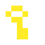 |

**Micro Torch (16×16, 2-Frame Animation 4 FPS):**

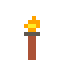

**Packed Item Atlas Sheet:**


---

### Use Case 2: Standard Resolution (32×32) — Character Action Suite & Multi-Directional Layouts

- **Resolution**: 32×32
- **Animation Suite**: Idle (3f), Walk (4f), Run (6f), Jump (4f), Attack (4f), Hurt (2f), Die (5f)
- **Directions**: Single, Side-Only (East/West Mirroring), 4-Dir (Down/Up/Left/Right), 8-Dir (Down/Up/Left/Right/SW/SE/NW/NE)
- **Palette**: Sweetie-16 (16 colors)

```bash
# 1. Pack full action suite sheet
python skills/pixel-art/scripts/atlas_pack.py --frames-dir examples/uc2_standard_32x32/actions_side_view --output examples/uc2_standard_32x32/hero_actions_sheet.png --cols 6 --json
python skills/pixel-art/scripts/gif_export.py --sheet examples/uc2_standard_32x32/hero_actions_sheet.png --frame-width 32 --frame-height 32 --fps 8 --output examples/uc2_standard_32x32/hero_actions.gif --json

# 2. Side-Only Directional Mirroring (East -> West)
python skills/pixel-art/scripts/sprite_mirror.py --input-dir examples/uc2_standard_32x32/east_walk_frames --output-dir examples/uc2_standard_32x32/west_walk_frames --axis horizontal --json
python skills/pixel-art/scripts/atlas_pack.py --frames-dir examples/uc2_standard_32x32/east_walk_frames --output examples/uc2_standard_32x32/east_walk_sheet.png --cols 4 --json
python skills/pixel-art/scripts/atlas_pack.py --frames-dir examples/uc2_standard_32x32/west_walk_frames --output examples/uc2_standard_32x32/west_walk_sheet.png --cols 4 --json

# 3. 4-Dir & 8-Dir Packing
python skills/pixel-art/scripts/atlas_pack.py --frames-dir examples/uc2_standard_32x32/character_4dir --output examples/uc2_standard_32x32/hero_4dir_sheet.png --cols 4 --json
python skills/pixel-art/scripts/atlas_pack.py --frames-dir examples/uc2_standard_32x32/character_8dir --output examples/uc2_standard_32x32/hero_8dir_sheet.png --cols 4 --json
```

#### 📸 Output Gallery (4× Zoom)

**Knight Action Animations (Walk Cycle 8 FPS & Action Sheet):**

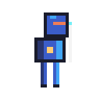

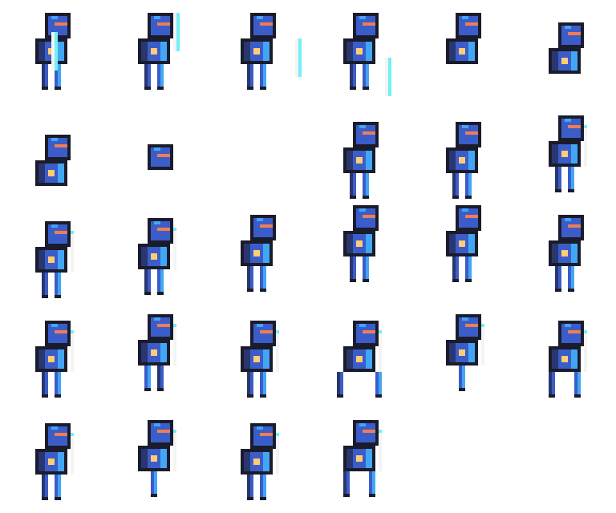

**Side-Only Mirroring (East vs West Mirrored):**

| East (Drawn) | West (Mirrored via `sprite_mirror.py`) |
|---|---|
| 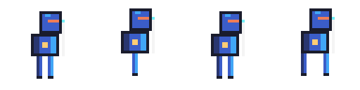 | 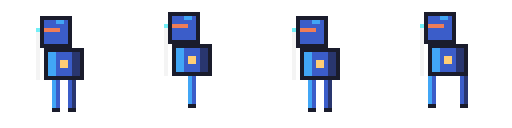 |

**4-Direction & 8-Direction Master Sheets:**

| 4-Dir Walk Sheet (Down, Up, Left, Right) | 8-Dir Walk Sheet (+ Diagonals) |
|---|---|
| 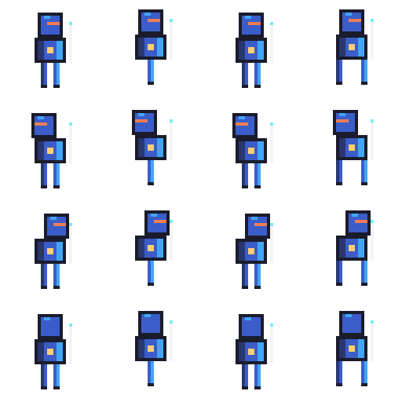 | 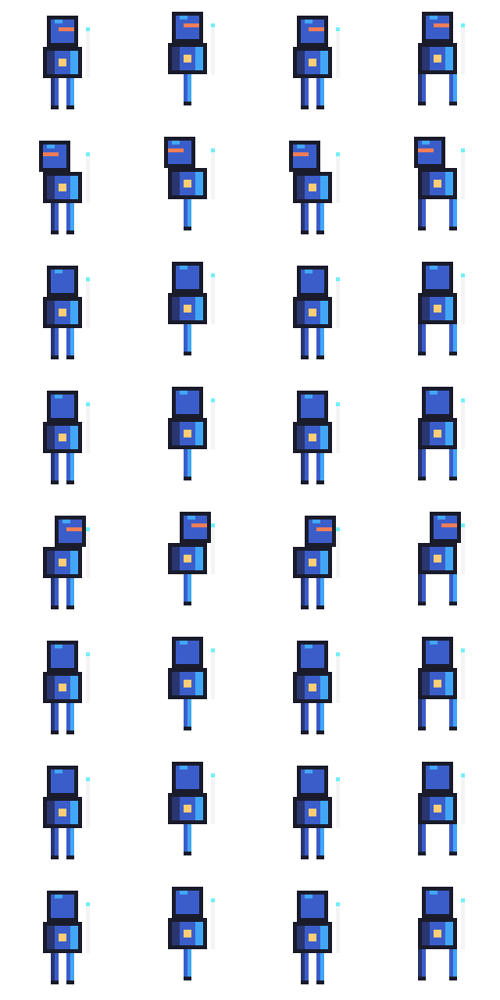 |

---

### Use Case 3: HD Resolution (64×64) — Seamless Overworld Tileset & Animated Terrain

- **Resolution**: 64×64
- **Animation**: 4-Frame Water Animation (6 FPS) + Procedural Value Noise & Bayer Dithered Gradient
- **Palette**: DawnBringer DB32 (32 colors)

```bash
# Generate procedural noise & dithered sky
python skills/pixel-art/scripts/noise_generator.py --width 64 --height 64 --scale 16 --octaves 3 --seed 777 --palette skills/pixel-art/palettes/db32.json --output examples/uc3_hd_64x64_tileset/procedural_terrain.png --json
python skills/pixel-art/scripts/dither.py --width 64 --height 64 --color1 '#1D2B53' --color2 '#73EFF7' --matrix 4 --output examples/uc3_hd_64x64_tileset/sky_dither.png --json

# Pack & export animated water
python skills/pixel-art/scripts/atlas_pack.py --frames-dir examples/uc3_hd_64x64_tileset/animated_water --output examples/uc3_hd_64x64_tileset/water_sheet.png --cols 4 --json
python skills/pixel-art/scripts/gif_export.py --sheet examples/uc3_hd_64x64_tileset/water_sheet.png --frame-width 64 --frame-height 64 --fps 6 --output examples/uc3_hd_64x64_tileset/water_animated.gif --json
```

#### 📸 Output Gallery (4× Zoom)

**HD Overworld Tiles (Grass, Dirt, Stone, Lava):**

| Grass | Dirt | Stone | Lava |
|---|---|---|---|
| 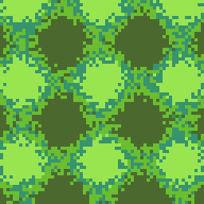 | 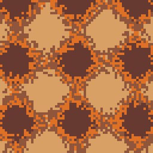 | 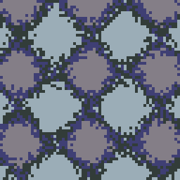 | 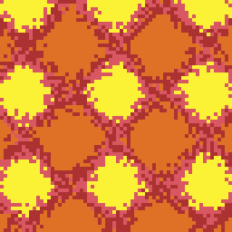 |

**Procedural Terrain & Dithered Sky:**

| Value Noise Terrain | Bayer 4×4 Dithered Sky | 4-Frame Animated Water (6 FPS) |
|---|---|---|
| 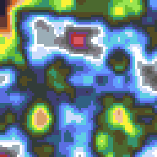 | 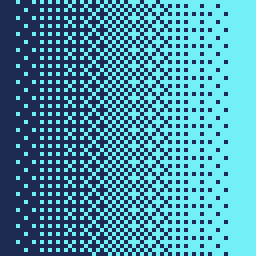 | 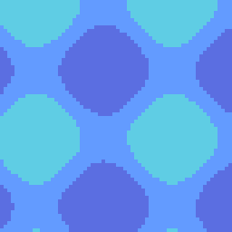 |

---

### Use Case 4: Large Resolution (128×128 & 256×256) — Boss Monster Portrait, Spell Cast & 12-Frame VFX Explosion

- **Resolution**: 128×128 & 256×256
- **Animation**: 6-Frame Magic Spell Cast (10 FPS) & 12-Frame Explosion VFX (16 FPS)
- **Palette**: Resurrect-64 & Sweetie-16

```bash
# Audit & resize 256x256 Boss Portrait
python skills/pixel-art/scripts/quality_audit.py --image examples/uc4_large_128_256/demon_boss_portrait_256x256.png --grid 16 --max-colors 64 --json
python skills/pixel-art/scripts/sprite_resize.py --input examples/uc4_large_128_256/demon_boss_portrait_256x256.png --output examples/uc4_large_128_256/demon_boss_portrait_512x512.png --scale 2 --json

# Pack & export 6-frame Spell Cast & 12-frame Explosion
python skills/pixel-art/scripts/atlas_pack.py --frames-dir examples/uc4_large_128_256/boss_spell_cast --output examples/uc4_large_128_256/spell_cast_sheet.png --cols 6 --json
python skills/pixel-art/scripts/atlas_pack.py --frames-dir examples/uc4_large_128_256/vfx_explosion_12frame --output examples/uc4_large_128_256/explosion_12frame_sheet.png --cols 6 --json
python skills/pixel-art/scripts/gif_export.py --sheet examples/uc4_large_128_256/explosion_12frame_sheet.png --frame-width 128 --frame-height 128 --fps 16 --output examples/uc4_large_128_256/explosion_12frame.gif --json
```

#### 📸 Output Gallery

**Demon Boss Portrait (256×256):**


**12-Frame Explosion VFX (16 FPS):**


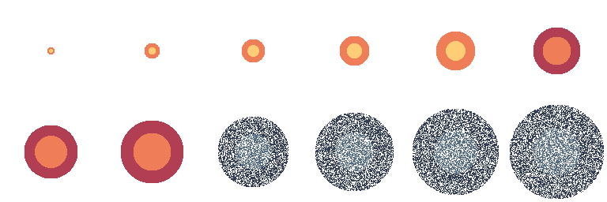

---

### Use Case 5: Ultra 4K Resolution (1024×1024, 2048×2048, 4096×4096) — Smooth 24-Frame Cinematic Canvas

- **Resolution**: Master 1024×1024 (1K), Scaled 2048×2048 (2K), 4096×4096 (4K Ultra HD)
- **Animation**: 24-Frame Smooth Cinematic Animation Sequence (24 FPS)
- **Palette**: Extracted Palette (via `palette_extract.py`)

```bash
# Scale 1K Master Canvas to 2K (2048x2048) and 4K (4096x4096)
python skills/pixel-art/scripts/sprite_resize.py --input examples/uc5_cinematic_4k/cinematic_canvas_1024x1024.png --output examples/uc5_cinematic_4k/cinematic_canvas_2048x2048_2K.png --scale 2 --json
python skills/pixel-art/scripts/sprite_resize.py --input examples/uc5_cinematic_4k/cinematic_canvas_1024x1024.png --output examples/uc5_cinematic_4k/cinematic_canvas_4096x4096_4K.png --scale 4 --json

# Extract dominant palette & export indexed 4K asset
python skills/pixel-art/scripts/palette_extract.py --image examples/uc5_cinematic_4k/cinematic_canvas_1024x1024.png --max-colors 16 --output examples/uc5_cinematic_4k/cinematic_palette.json --json
python skills/pixel-art/scripts/export_indexed.py --input examples/uc5_cinematic_4k/cinematic_canvas_1024x1024.png --output examples/uc5_cinematic_4k/cinematic_canvas_1024_indexed.png --max-colors 16 --json

# Pack & Export 24-Frame Smooth Cinematic (24 FPS)
python skills/pixel-art/scripts/atlas_pack.py --frames-dir examples/uc5_cinematic_4k/cinematic_smooth_24frame --output examples/uc5_cinematic_4k/cinematic_24frame_sheet.png --cols 6 --json
python skills/pixel-art/scripts/gif_export.py --sheet examples/uc5_cinematic_4k/cinematic_24frame_sheet.png --frame-width 256 --frame-height 256 --fps 24 --output examples/uc5_cinematic_4k/cinematic_smooth_24fps.gif --json
```

#### 📸 Output Gallery

**Cinematic Pixel Art Landscape (1024×1024 → 4096×4096 4K Canvas):**

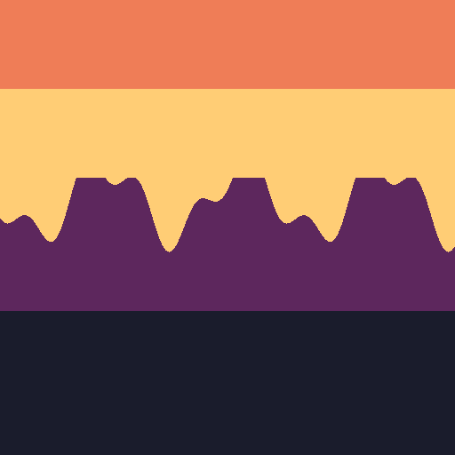

**24-Frame Smooth Animation Cutscene (24 FPS):**

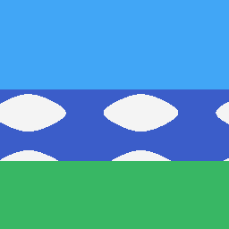

---

## Available Palettes

| Palette | Colors | Era / Style |
|---|---|---|
| `pico-8.json` | 16 | Fantasy console, vibrant |
| `gameboy.json` | 4 | Game Boy DMG-01, green monochrome |
| `nes.json` | 56 | NES PPU NTSC hardware |
| `snes.json` | 64 | Super Nintendo curated |
| `endesga-32.json` | 32 | ENDESGA modern pixel art |
| `resurrect-64.json` | 64 | Resurrect high-color |
| `sweetie-16.json` | 16 | Sweetie 16 pastel game jam |
| `db32.json` | 32 | DawnBringer 32 versatile |
| `cga.json` | 4 | IBM PC CGA DOS mode |
| `commodore-64.json` | 16 | C64 hardware palette |
| `lospec-500.json` | 32 | Lospec community favorite |

---

## License

[MIT License](LICENSE.txt) © 2026 Ervareza
