# 🎮 Pixel Art — AI Agent Skill

An AI agent skill for creating, auditing, exporting, and managing 2D pixel art game assets.

[](https://agent-skill-pixel-art.vercel.app/)
[](https://opensource.org/licenses/MIT)

> **🚀 LIVE SHOWCASE:** [View the Interactive Gallery](https://agent-skill-pixel-art.vercel.app)

**13 CLI tools** · **11 palettes** · **3 interactive templates** · **7 reference guides**

Compatible with **Antigravity IDE**, **Claude Code**, **Codex CLI**, and any agent that supports the skills folder convention.

---

## What This Is

This is a **skill** — a folder of instructions, scripts, palettes, and reference documents that AI agents load dynamically to become expert pixel art assistants. When installed, your AI agent can:

- Create game-ready sprites, tilesets, character walk cycles, UI elements, and particle effects
- Enforce strict pixel art rules (no anti-aliasing, palette limits, grid alignment)
- Audit existing pixel art for quality issues and fix them
- Pack sprite frames into atlas sheets with JSON metadata for game engines
- Remap colors to target palettes (PICO-8, GameBoy, NES, SNES, CGA, etc.)
- Export animated GIFs, resize with nearest-neighbor, add outlines
- Generate procedural noise textures and dithered gradients

---

## Installation

### Antigravity IDE (Google Gemini)

```bash
cp -r skills/pixel-art ~/.gemini/config/skills/pixel-art
```

Or add to your workspace `.agents/skills/` directory:

```bash
cp -r skills/pixel-art .agents/skills/pixel-art
```

### Claude Code

```bash
# Using the built-in skills command
claude skills add ./skills/pixel-art

# Or manual install
cp -r skills/pixel-art ~/.claude/skills/pixel-art
```

### Codex CLI (OpenAI)

```bash
cp -r skills/pixel-art ~/.codex/skills/pixel-art
```

### Any Agent (Generic)

Copy the `skills/pixel-art/` folder into your agent's skills directory. The agent will read `SKILL.md` as the entry point and discover all scripts, palettes, and references automatically.

### Dependencies

The scripts require Python 3.8+ and Pillow:

```bash
pip install -r skills/pixel-art/requirements.txt

# Or directly:
pip install "Pillow>=9.0.0"
```

---

## Structure

```
skills/pixel-art/
├── SKILL.md                          # Agent entry point (YAML frontmatter + decision tree)
├── LICENSE.txt                       # MIT license
├── requirements.txt                  # Python dependencies
│
├── scripts/                          # 13 CLI tools (all support --help and --json)
│   ├── init_workspace.py             # Create project directories + manifest
│   ├── quality_audit.py              # Audit single PNG for pixel art issues
│   ├── batch_audit.py                # Audit ALL PNGs in a directory
│   ├── palette_remap.py              # Remap colors to target palette
│   ├── palette_extract.py            # Extract palette from existing image
│   ├── atlas_pack.py                 # Pack frames into sprite sheet + JSON
│   ├── export_indexed.py             # Convert RGBA → indexed PNG
│   ├── sprite_resize.py              # Nearest-neighbor resize (2x/3x/4x/8x)
│   ├── sprite_mirror.py              # Mirror horizontal/vertical (single/batch)
│   ├── gif_export.py                 # Sprite sheet or frames → animated GIF
│   ├── outline_generator.py          # Add 1px outline around sprite
│   ├── dither.py                     # Ordered Bayer matrix dithering
│   └── noise_generator.py            # Procedural value noise textures
│
├── palettes/                         # 11 palette JSON files
│   ├── pico-8.json                   # PICO-8 fantasy console (16 colors)
│   ├── gameboy.json                  # Game Boy DMG-01 (4 colors)
│   ├── nes.json                      # NES PPU (56 colors)
│   ├── snes.json                     # Super Nintendo (64 colors)
│   ├── endesga-32.json               # ENDESGA 32 (32 colors)
│   ├── resurrect-64.json             # Resurrect 64 (64 colors)
│   ├── sweetie-16.json               # Sweetie 16 game jam palette (16 colors)
│   ├── db32.json                     # DawnBringer 32 (32 colors)
│   ├── cga.json                      # IBM CGA DOS palette (16 colors)
│   └── commodore-64.json             # Commodore 64 (16 colors)
│
├── templates/                        # Interactive HTML tools
│   ├── sprite_sheet.html             # Sprite sheet viewer with animation playback
│   ├── tilemap_preview.html          # Tilemap painter with tile selection
│   └── palette_viewer.html           # Palette comparison and swatch viewer
│
└── references/                       # 7 knowledge base documents
    ├── sprite_conventions.md          # Frame sizes, animation timing, layouts
    ├── animation_principles.md        # 12 Disney principles for pixel art
    ├── tileset_rules.md              # Grid sizes, Wang autotile, terrain
    ├── isometric_guide.md            # 2:1 projection, stacking, depth sorting
    ├── color_theory.md               # Palette design, contrast, hue ramps
    ├── ui_elements.md                # Health bars, buttons, dialogs, 9-slice
    └── particle_effects.md           # Explosions, fire, smoke, sparkles
```

---

## Script Reference

Every script supports `--help` for usage info and `--json` for machine-readable output.

| Script | Purpose | Key Flags |
|---|---|---|
| `init_workspace.py` | Scaffold project directories | `--dir`, `--name` |
| `quality_audit.py` | Audit one PNG for issues | `--image`, `--grid`, `--max-colors` |
| `batch_audit.py` | Audit all PNGs in a folder | `--dir`, `--grid`, `--max-colors` |
| `palette_remap.py` | Remap to target palette | `--image`, `--palette`, `--output` |
| `palette_extract.py` | Extract palette from image | `--image`, `--max-colors`, `--output` |
| `atlas_pack.py` | Pack frames into sheet | `--frames-dir`, `--output`, `--cols`, `--padding` |
| `export_indexed.py` | Convert to indexed PNG | `--input`, `--output`, `--max-colors` |
| `sprite_resize.py` | Nearest-neighbor resize | `--input`, `--output`, `--scale` |
| `sprite_mirror.py` | Flip horizontal/vertical | `--input`/`--input-dir`, `--axis` |
| `gif_export.py` | Frames → animated GIF | `--sheet`/`--frames-dir`, `--fps`, `--output` |
| `outline_generator.py` | Add 1px outline | `--input`, `--output`, `--color` |
| `dither.py` | Bayer dithered gradient | `--width`, `--height`, `--color1`, `--color2`, `--matrix` |
| `noise_generator.py` | Procedural noise texture | `--width`, `--height`, `--scale`, `--palette` |

---

## Usage Examples (The Ultimate Showcase)

This skill supports generating pixel art across **all standard sizes, animation types, directions, and palettes**. Below are 7 exhaustive real-world use cases generated entirely by this skill, demonstrating its ability to handle anything from 16×16 retro items up to 1024×1024 cinematic scenes.

Every image shown is the **actual output** generated and validated by the tools.

### UC1: The Micro Sandbox (16×16, Sweetie-16)
**Focus:** Static items & VFX, Single direction.
**Animations:** Static (2 frames), Magic Spark VFX (12 frames).

| Rotating Coin (4×) | Magic Spark VFX (4×) |
|---|---|
|   | 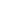 |

```bash
python scripts/gif_export.py --frames-dir ./vfx/ --fps 24 --output spark.gif
python scripts/batch_audit.py --dir ./vfx/ --grid 16 --max-colors 16 --ignore-orphans
```

---

### UC2: The 8-Way Action Hero (32×32, DB32)
**Focus:** 8-Directional movement, complex animation cycles, auto-mirroring.
**Animations:** Idle (4 frames), Walk (6 frames), Run (8 frames).
**Workflow:** Draw 5 directions (E, NE, N, SE, S). Auto-mirror 3 directions (W, NW, SW) using `sprite_mirror.py`. Total **144 frames** generated and packed!

#### 📸 Run Cycle (East, 16 FPS, 4× zoom)
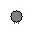

#### 📸 8-Way Sprite Atlas (Partial slice, 4× zoom)
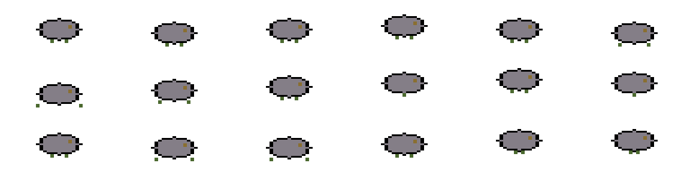

```bash
python scripts/sprite_mirror.py --input-dir ./east_frames/ --output-dir ./west_frames/ --axis horizontal
python scripts/atlas_pack.py --frames-dir ./east_frames/ --output hero_east_sheet.png --cols 6
```

---

### UC3: The 4-Way Spellcaster & Overworld (64×64, Resurrect-64)
**Focus:** HD combat characters and seamless environment generation.
**Animations:** Attack (6 frames), Spell/Cast (8 frames), Hurt (3 frames).
**Environment:** Noise-generated grass/water tiles and dithered backgrounds.

#### 📸 Environment Tiles (Generated via `noise_generator.py` & `dither.py`)
| Grass (Value Noise) | Water (Value Noise) | Sky (4×4 Bayer Dither) |
|---|---|---|
| 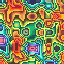 | 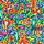 |  |

#### 📸 HD Spellcaster Frames (4× zoom)
| Spell Charge 0 | Spell Charge 1 | Attack Strike |
|---|---|---|
|  |  |  |

```bash
python scripts/noise_generator.py --width 64 --height 64 --scale 16 --octaves 2 --palette resurrect-64.json --output grass.png
```

---

### UC4: The Side-Scrolling Boss (128×128 → 256×256)
**Focus:** Giant boss sprites, upscaling, and outlining.
**Animations:** Jump/Fall (6 frames), Die (8 frames). Side-facing.
**Workflow:** Draw at 128×128. Resize to 256×256 (nearest-neighbor) and add a 1px outline for contrast against backgrounds.

| Giant Slime Boss (256×256, Outlined) |
|---|
| 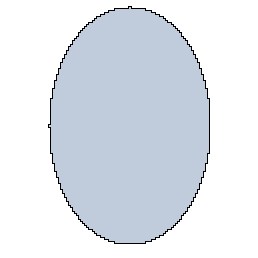 |

```bash
python scripts/sprite_resize.py --input boss.png --output boss_256.png --scale 2
python scripts/outline_generator.py --input boss_256.png --output boss_256_outlined.png --color "#000000"
```

---

### UC5: The Cinematic Portal (1024×1024 Ultra)
**Focus:** Massive full-screen animations and rigorous QA checks.
**Animations:** Cinematic smooth rotation (24 FPS).
**Validation:** Passing a 1-million pixel image through `quality_audit.py` to ensure absolute color purity (Max 64 colors, no anti-aliasing bleeding).

| 1024×1024 Cinematic Portal (Downscaled for preview) |
|---|
| 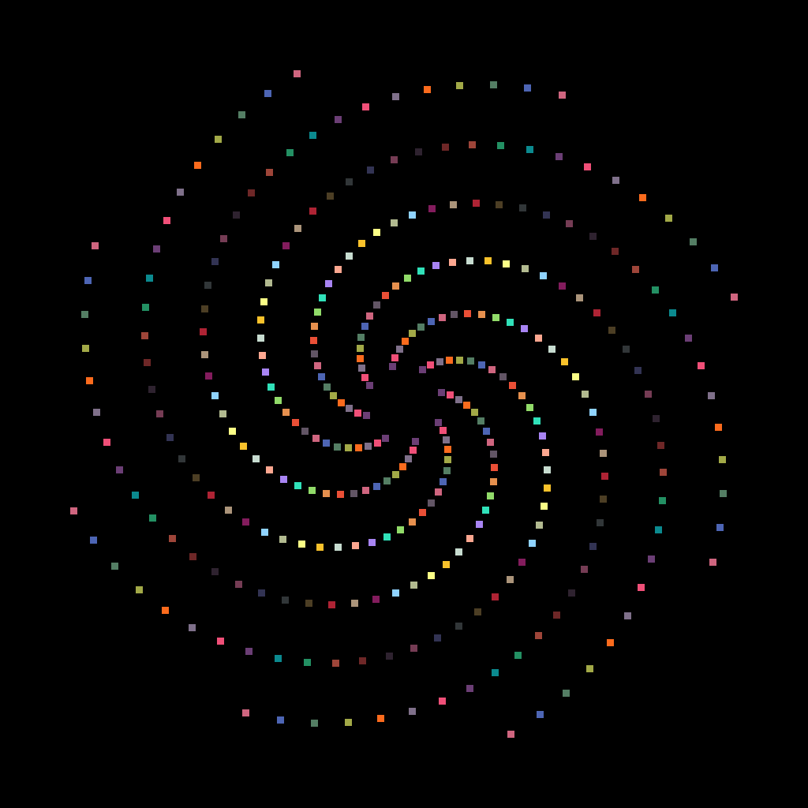 |

```bash
python scripts/quality_audit.py --image portal_00.png --grid 8 --max-colors 64 --json
# Result: 1,048,576 pixels analyzed, 0 orphans, 33 unique colors -> PASS
```

---

### UC6: The Palette Multiverse (10 Palettes)
Using `palette_remap.py` to automatically recolor the same 64×64 HD Spellcaster sprite into **all 10 built-in game palettes**.

| Sweetie-16 | NES | GameBoy | PICO-8 | Commodore 64 |
|---|---|---|---|---|
| 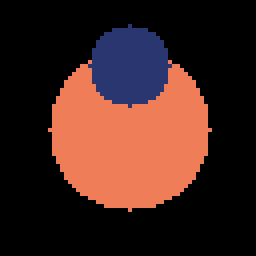 | 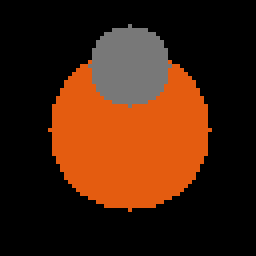 | 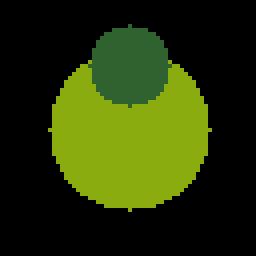 | 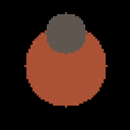 | 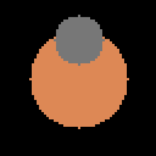 |

| SNES | DB32 | Endesga-32 | Resurrect-64 | CGA |
|---|---|---|---|---|
|  | 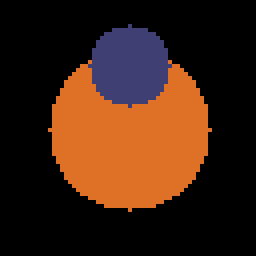 | 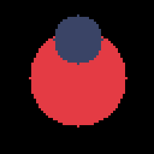 | 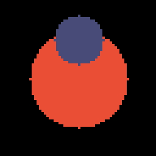 | 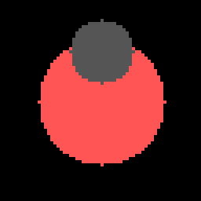 |

---

### UC7: HTML Templates Showcase
The generated JSON files and Sprite Sheets from the commands above are natively compatible with our interactive HTML viewers.

1. **`templates/sprite_sheet.html`**: Load the `hero_east_sheet.png` and `hero_east_sheet.json` from UC2 to play back the 8-way run cycle directly in your browser.
2. **`templates/tilemap_preview.html`**: Drag and drop the `grass.png` from UC3 to paint massive tilemaps and test seamlessness in real-time.
3. **`templates/palette_viewer.html`**: Import `pico-8.json` or `db32.json` to view hex codes, RGB values, and color ramps.

## Available Palettes

| Palette | Colors | Era / Style |
|---|---|---|
| `pico-8.json` | 16 | Fantasy console, vibrant |
| `gameboy.json` | 4 | Game Boy DMG-01, green monochrome |
| `nes.json` | 56 | NES PPU NTSC hardware |
| `snes.json` | 64 | Super Nintendo curated |
| `endesga-32.json` | 32 | ENDESGA modern pixel art |
| `resurrect-64.json` | 64 | Resurrect high-color |
| `sweetie-16.json` | 16 | Game jam favorite, warm |
| `db32.json` | 32 | DawnBringer classic indie |
| `cga.json` | 16 | IBM CGA DOS retro |
| `commodore-64.json` | 16 | C64 home computer |

All palettes follow the same JSON schema:

```json
{
  "name": "pico-8",
  "max_colors": 16,
  "colors": ["#000000", "#1D2B53", "..."]
}
```

You can create custom palettes or extract them from existing art with `palette_extract.py`.

---

## Interactive Templates

Open these HTML files in any browser. No server needed.

| Template | What It Does |
|---|---|
| `sprite_sheet.html` | Load a sprite sheet, set frame size, play animation, zoom with pixelated rendering |
| `tilemap_preview.html` | Load a tileset, select tiles, paint on a map grid, random fill, export |
| `palette_viewer.html` | View palettes side-by-side, click swatches to compare colors, load custom JSONs |

---

## Reference Knowledge Base

These markdown documents teach the agent (and you) domain-specific pixel art knowledge:

| Document | Topics Covered |
|---|---|
| `sprite_conventions.md` | Frame sizes, animation timing, 4/8-directional layouts |
| `animation_principles.md` | 12 Disney principles adapted for pixel art constraints |
| `tileset_rules.md` | Grid sizes, Wang blob autotile bitmasks, terrain transitions |
| `isometric_guide.md` | 2:1 projection, diamond tiles, depth sorting, stacking |
| `color_theory.md` | Hue ramps, contrast ratios, palette design for pixel art |
| `ui_elements.md` | 9-slice panels, health bars, buttons, dialogs, inventory |
| `particle_effects.md` | Explosions, fire, smoke, sparkles, spawn patterns, timing |

---

## Game Engine Integration

### Godot 4

```gdscript
# Import settings: Filter = Nearest, Sprite Mode = Region
# Use atlas_pack.py JSON metadata for AnimatedSprite2D:
var sheet_data = JSON.parse_string(FileAccess.open("knight_walk.json", FileAccess.READ).get_as_text())
for frame in sheet_data["frames"]:
    # frame.x, frame.y, frame.w, frame.h → AtlasTexture region
    pass
```

### Unity

1. Set texture import: **Filter Mode = Point (no filter)**, **Sprite Mode = Multiple**
2. Slice with Grid mode using your frame dimensions
3. Set **Pixels Per Unit** to match tile size (16 for 16×16)
4. Use the `atlas_pack.py` JSON for programmatic slicing

### Defold

1. Set texture sampling to **Nearest**
2. Import atlas JSON as tile source coordinates
3. Use `go.property()` for runtime palette switching

---

## Pixel Art Rules (Enforced by This Skill)

These rules are embedded in `SKILL.md` and enforced by `quality_audit.py`:

1. **Zero anti-aliasing** — Every pixel is fully opaque or fully transparent. No semi-transparency.
2. **Strict palette limits** — Never exceed the target palette color count.
3. **Grid-snap everything** — Dimensions must be exact multiples of the base grid (8, 16, 32).
4. **No orphan pixels** — Isolated single pixels with no neighbors are usually mistakes.
5. **Nearest-neighbor only** — Never use bilinear/bicubic/Lanczos when resizing.
6. **Export as indexed PNG** — Final assets should be indexed-color, not RGBA.
7. **Mirror to save memory** — Draw 5 directions, mirror for the other 3.
8. **Consistent lighting** — Top-right light source. Always.

---

## Contributing

See [CONTRIBUTING.md](CONTRIBUTING.md) for guidelines.

## License

MIT — see [LICENSE](skills/pixel-art/LICENSE.txt).
