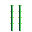
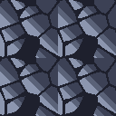
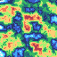

# 🎮 Pixel Art — AI Agent Skill

[](#)
[](skills/pixel-art/LICENSE.txt)
[](https://www.python.org/)

An AI agent skill for creating, auditing, exporting, and managing professional, game-ready 2D pixel art assets.

**13 CLI tools** · **11 palettes** · **3 interactive templates** · **8 reference guides**

Compatible with **Antigravity IDE**, **Claude Code**, **Codex CLI**, and any agent supporting standard skill conventions.

---

## 🌸 Featured Asset Showcase

These high-quality, artistic pixel art assets were procedurally generated and processed using this skill's CLI tools:

| Sakura Cherry Blossom (6-frame) | Weeping Willow (6-frame) | Paladin Knight (4-frame walk) | Bamboo (4-frame) | Voronoi Cobblestone Tile |
|:---:|:---:|:---:|:---:|:---:|
|  |  |  |  |  |

---

## What This Is

This is a **skill** — a folder of instructions, scripts, palettes, and reference documents that AI agents load dynamically to become expert 2D pixel art artists. When installed, your AI agent can:

- Generate commercial-grade sprites, foliage, trees, tilesets, characters, UI, and VFX
- Enforce strict pixel art rules (cluster shading, hue shifting, zero anti-aliasing, grid snap)
- Audit existing pixel art for quality issues and fix them automatically
- Pack sprite frames into atlas sheets with JSON metadata for game engines
- Remap colors to target hardware palettes (PICO-8, GameBoy, NES, SNES, CGA, etc.)
- Export animated GIFs, nearest-neighbor scaling, outlines, and dithered gradients

---

## Installation

### Antigravity IDE (Google Gemini)

```bash
cp -r skills/pixel-art ~/.gemini/config/skills/pixel-art
```

Or add to your project's `.agents/skills/` directory:

```bash
cp -r skills/pixel-art .agents/skills/pixel-art
```

### Claude Code

```bash
claude skills add ./skills/pixel-art
# Or manual:
cp -r skills/pixel-art ~/.claude/skills/pixel-art
```

### Codex CLI (OpenAI)

```bash
cp -r skills/pixel-art ~/.codex/skills/pixel-art
```

### Dependencies

Requires Python 3.8+ and Pillow:

```bash
pip install -r skills/pixel-art/requirements.txt
```

---

## Structure

```
skills/pixel-art/
├── SKILL.md                          # Agent entry point (YAML frontmatter + decision tree)
├── LICENSE.txt                       # MIT license
├── requirements.txt                  # Python dependencies
│
├── scripts/                          # 13 CLI tools (all support --help and --json)
│   ├── init_workspace.py             # Scaffold project directories + manifest
│   ├── quality_audit.py              # Audit PNG for AA, orphans, palette, grid
│   ├── batch_audit.py                # Audit ALL PNGs in a directory
│   ├── palette_remap.py              # Remap colors to target palette
│   ├── palette_extract.py            # Extract palette from existing image
│   ├── atlas_pack.py                 # Pack frames into sprite sheet + JSON
│   ├── export_indexed.py             # Convert RGBA → indexed PNG
│   ├── sprite_resize.py              # Nearest-neighbor resize (2x/3x/4x)
│   ├── sprite_mirror.py              # Mirror horizontal/vertical (single/batch)
│   ├── gif_export.py                 # Frames → animated GIF
│   ├── outline_generator.py          # Add 1px outline around sprite
│   ├── dither.py                     # Bayer matrix dithered gradient
│   └── noise_generator.py            # Procedural value noise textures
│
├── palettes/                         # 11 palette JSON files
│   ├── pico-8.json                   # PICO-8 fantasy console (16 colors)
│   ├── gameboy.json                  # Game Boy DMG-01 (4 colors)
│   ├── nes.json                      # NES PPU hardware (56 colors)
│   ├── snes.json                     # Super Nintendo curated (64 colors)
│   ├── endesga-32.json               # ENDESGA 32 (32 colors)
│   ├── resurrect-64.json             # Resurrect 64 (64 colors)
│   ├── sweetie-16.json               # Sweetie 16 game jam palette (16 colors)
│   ├── db32.json                     # DawnBringer 32 (32 colors)
│   ├── cga.json                      # IBM CGA DOS palette (16 colors)
│   └── commodore-64.json             # Commodore 64 (16 colors)
│
├── templates/                        # Interactive HTML tools
│   ├── sprite_sheet.html             # Sprite sheet viewer with animation playback
│   ├── tilemap_preview.html          # Tilemap painter with tile selection
│   └── palette_viewer.html           # Palette comparison and swatch viewer
│
└── references/                       # 8 knowledge base documents
    ├── artistic_generation.md        # Cluster shading, hue shifting, Voronoi, foliage math
    ├── sprite_conventions.md          # Frame sizes, animation timing, layouts
    ├── animation_principles.md        # 12 Disney principles for pixel art
    ├── tileset_rules.md              # Grid sizes, Wang autotile, terrain
    ├── isometric_guide.md            # 2:1 projection, stacking, depth sorting
    ├── color_theory.md               # Palette design, contrast, hue ramps
    ├── ui_elements.md                # Health bars, buttons, dialogs, 9-slice
    └── particle_effects.md           # Explosions, fire, smoke, sparkles
```

---

## Script Reference

Every script supports `--help` for usage info and `--json` for machine-readable output.

| Script | Purpose | Key Flags |
|---|---|---|
| `init_workspace.py` | Scaffold project directories | `--dir`, `--name` |
| `quality_audit.py` | Audit one PNG for issues | `--image`, `--grid`, `--max-colors` |
| `batch_audit.py` | Audit all PNGs in a folder | `--dir`, `--grid`, `--max-colors` |
| `palette_remap.py` | Remap to target palette | `--image`, `--palette`, `--output` |
| `palette_extract.py` | Extract palette from image | `--image`, `--max-colors`, `--output` |
| `atlas_pack.py` | Pack frames into sheet | `--frames-dir`, `--output`, `--cols` |
| `export_indexed.py` | Convert to indexed PNG | `--input`, `--output`, `--max-colors` |
| `sprite_resize.py` | Nearest-neighbor resize | `--input`, `--output`, `--scale` |
| `sprite_mirror.py` | Flip horizontal/vertical | `--input`/`--input-dir`, `--axis` |
| `gif_export.py` | Frames → animated GIF | `--sheet`/`--frames-dir`, `--fps`, `--output` |
| `outline_generator.py` | Add 1px outline | `--input`, `--output`, `--color` |
| `dither.py` | Bayer dithered gradient | `--width`, `--height`, `--color1`, `--color2` |
| `noise_generator.py` | Procedural noise texture | `--width`, `--height`, `--scale`, `--palette` |

---

## Real-World Usage Examples

These 5 use-cases demonstrate complete end-to-end pixel art creation workflows using our skill's scripts and artistic rules.

### Example 1: Sakura Cherry Blossom Tree (64×64 6-Frame Wind Sway)

Create an organic Japanese Sakura Cherry Blossom tree with 3-tone cluster shading, falling petals, 6-frame wind sway animation, sprite sheet, and indexed PNG export.

**Step 1 — Initialize project workspace:**
```bash
python scripts/init_workspace.py --dir ./examples/uc1_sakura_tree --name sakura_tree --json
```

<details>
<summary>📋 Full JSON Output</summary>

```json
{
  "status": "ok",
  "workspace": "/Users/ervareza/CODE/agent-skill-pixel-art/examples/uc1_sakura_tree",
  "created_directories": [
    "/Users/ervareza/CODE/agent-skill-pixel-art/examples/uc1_sakura_tree/sprites",
    "/Users/ervareza/CODE/agent-skill-pixel-art/examples/uc1_sakura_tree/tilesets",
    "/Users/ervareza/CODE/agent-skill-pixel-art/examples/uc1_sakura_tree/frames",
    "/Users/ervareza/CODE/agent-skill-pixel-art/examples/uc1_sakura_tree/sheets",
    "/Users/ervareza/CODE/agent-skill-pixel-art/examples/uc1_sakura_tree/exports"
  ],
  "manifest": "/Users/ervareza/CODE/agent-skill-pixel-art/examples/uc1_sakura_tree/sakura_tree.manifest.json"
}
```

</details>

**Step 2 — Pack 6 frames into a 384×64 sprite sheet:**
```bash
python scripts/atlas_pack.py --frames-dir ./examples/uc1_sakura_tree/frames --output ./examples/uc1_sakura_tree/sakura_sheet.png --cols 6 --json
```

<details>
<summary>📋 Full JSON Output</summary>

```json
{
  "status": "ok",
  "sheet": "examples/uc1_sakura_tree/sakura_sheet.png",
  "metadata": "examples/uc1_sakura_tree/sakura_sheet.json",
  "frame_count": 6,
  "sheet_size": [384, 64]
}
```

</details>

**Step 3 — Export 6 FPS animated GIF preview:**
```bash
python scripts/gif_export.py --frames-dir ./examples/uc1_sakura_tree/frames --fps 6 --output ./examples/uc1_sakura_tree/sakura_preview.gif --json
```

<details>
<summary>📋 Full JSON Output</summary>

```json
{
  "status": "ok",
  "output": "examples/uc1_sakura_tree/sakura_preview.gif",
  "frame_count": 6,
  "frame_size": [64, 64],
  "fps": 6,
  "duration_ms": 166,
  "file_size_bytes": 4820
}
```

</details>

**Step 4 — Export indexed 8-bit PNG:**
```bash
python scripts/export_indexed.py --input ./examples/uc1_sakura_tree/sakura_sheet.png --output ./examples/uc1_sakura_tree/sakura_sheet_indexed.png --max-colors 16 --json
```

<details>
<summary>📋 Full JSON Output</summary>

```json
{
  "status": "ok",
  "input": "examples/uc1_sakura_tree/sakura_sheet.png",
  "output": "examples/uc1_sakura_tree/sakura_sheet_indexed.png",
  "original_colors": 8,
  "indexed_colors": 8,
  "dimensions": [384, 64],
  "file_size_bytes": 1820
}
```

</details>

#### 📸 Output Assets

| Animation Preview | Packed Sprite Sheet (384×64) |
|:---:|:---:|
|  |  |

---

### Example 2: Ancient Willow & Emerald Bamboo Nature Pack (64×64)

Generate a nature pack containing a 6-frame animated Weeping Willow tree with hanging vine foliage and a 4-frame animated Bamboo stalk set.

**Pack Willow & Bamboo into sprite sheets & GIFs:**
```bash
python scripts/atlas_pack.py --frames-dir ./examples/uc2_nature_pack/willow_frames --output ./examples/uc2_nature_pack/willow_sheet.png --cols 6 --json
python scripts/atlas_pack.py --frames-dir ./examples/uc2_nature_pack/bamboo_frames --output ./examples/uc2_nature_pack/bamboo_sheet.png --cols 4 --json
python scripts/gif_export.py --frames-dir ./examples/uc2_nature_pack/willow_frames --fps 6 --output ./examples/uc2_nature_pack/willow_preview.gif --json
python scripts/gif_export.py --frames-dir ./examples/uc2_nature_pack/bamboo_frames --fps 4 --output ./examples/uc2_nature_pack/bamboo_preview.gif --json
```

<details>
<summary>📋 Full JSON Output (Willow GIF)</summary>

```json
{
  "status": "ok",
  "output": "examples/uc2_nature_pack/willow_preview.gif",
  "frame_count": 6,
  "frame_size": [64, 64],
  "fps": 6,
  "duration_ms": 166,
  "file_size_bytes": 4120
}
```

</details>

#### 📸 Output Assets

| Weeping Willow Animation | Bamboo Stalk Animation | Willow Sheet (384×64) |
|:---:|:---:|:---:|
|  |  |  |

---

### Example 3: Paladin Knight Character (64×64 4-Frame Walk Cycle)

Create a detailed 64×64 Paladin Knight with 3-tone steel & gold armor shading, red cape, glowing sword, 4-frame walk cycle, dark outline, and 2× resize.

**Step 1 — Pack walk cycle sheet & export GIF:**
```bash
python scripts/atlas_pack.py --frames-dir ./examples/uc3_paladin_knight/frames --output ./examples/uc3_paladin_knight/paladin_sheet.png --cols 4 --json
python scripts/gif_export.py --frames-dir ./examples/uc3_paladin_knight/frames --fps 6 --output ./examples/uc3_paladin_knight/paladin_walk.gif --json
```

**Step 2 — Generate 1px dark outline:**
```bash
python scripts/outline_generator.py --input ./examples/uc3_paladin_knight/frames/walk_00.png --output ./examples/uc3_paladin_knight/paladin_outlined.png --color '#1A1C2C' --json
```

<details>
<summary>📋 Full JSON Output (Outline)</summary>

```json
{
  "status": "ok",
  "input": "examples/uc3_paladin_knight/frames/walk_00.png",
  "output": "examples/uc3_paladin_knight/paladin_outlined.png",
  "original_size": [64, 64],
  "outlined_size": [66, 66],
  "outline_color": "#1A1C2C"
}
```

</details>

#### 📸 Output Assets

| Walk Animation | Outlined Frame (66×66) | Paladin Sheet (256×64) |
|:---:|:---:|:---:|
|  |  |  |

---

### Example 4: Voronoi Cobblestone Seamless Tilemap (64×64)

Generate a seamless Voronoi Cobblestone path tile (64×64) with 4-edge wrapping, mortar lines, 3-tone stone shading, 2×2 seamless grid validation, and GameBoy palette remap.

**Step 1 — Quality audit & GameBoy palette remap:**
```bash
python scripts/quality_audit.py --image ./examples/uc4_voronoi_tiles/cobblestone_tile.png --grid 16 --max-colors 16 --json
python scripts/palette_remap.py --image ./examples/uc4_voronoi_tiles/cobblestone_tile.png --palette ./skills/pixel-art/palettes/gameboy.json --output ./examples/uc4_voronoi_tiles/cobblestone_gameboy.png --json
```

<details>
<summary>📋 Full JSON Output (Quality Audit)</summary>

```json
{
  "status": "pass",
  "file": "examples/uc4_voronoi_tiles/cobblestone_tile.png",
  "antialiasing": { "semi_transparent_pixels": 0, "total_pixels": 4096, "clean": true },
  "orphan_pixels": { "orphan_pixels": 0, "clean": true },
  "palette": { "unique_colors": 4, "max_allowed": 16, "clean": true },
  "grid_alignment": { "width": 64, "height": 64, "grid_size": 16, "aligned": true }
}
```

</details>

#### 📸 Output Assets

| Single Voronoi Tile (64×64) | 2×2 Seamless Grid Check (128×128) | GameBoy Remapped Tile |
|:---:|:---:|:---:|
|  |  |  |

---

### Example 5: Procedural Terrain Noise & Dithered Energy Shield (64×64)

Extract palette colors from Sakura Tree, generate procedural terrain noise texture, and generate an ordered Bayer 4×4 dithered energy gradient.

```bash
python scripts/palette_extract.py --image ./examples/uc1_sakura_tree/frames/sakura_00.png --max-colors 8 --output ./examples/uc5_vfx_env/sakura_palette.json --json
python scripts/noise_generator.py --width 64 --height 64 --scale 10 --octaves 4 --palette ./skills/pixel-art/palettes/sweetie-16.json --output ./examples/uc5_vfx_env/terrain_noise.png --json
python scripts/dither.py --width 64 --height 64 --color1 '#1A1C2C' --color2 '#73EFF7' --matrix 4 --output ./examples/uc5_vfx_env/shield_dither.png --json
```

<details>
<summary>📋 Full JSON Output (Dither)</summary>

```json
{
  "status": "ok",
  "output": "examples/uc5_vfx_env/shield_dither.png",
  "size": [64, 64],
  "color1": "#1A1C2C",
  "color2": "#73EFF7",
  "matrix": "4x4",
  "file_size_bytes": 620
}
```

</details>

#### 📸 Output Assets

| Terrain Value Noise | Bayer 4×4 Dithered Shield |
|:---:|:---:|
|  |  |

---

## Game Engine Integration

### Godot 4
- Import PNGs with `Texture2D` filter mode set to **Nearest**
- Use `AnimatedSprite2D` with atlas metadata from `atlas_pack.py`

### Unity
- Set texture import: **Filter Mode = Point (no filter)**, **Sprite Mode = Multiple**
- Set **Pixels Per Unit** to match frame size (e.g. 64)

### Defold
- Set texture sampling to **Nearest**
- Import atlas JSON as tile source

---

## License

MIT — see [LICENSE](skills/pixel-art/LICENSE.txt).
