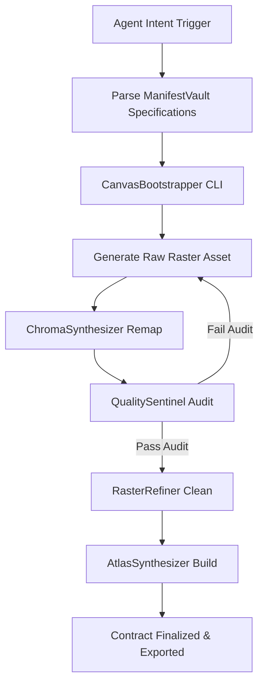

# ChromaMatrix Core — Execution Orchestration Protocol

Step-by-step autonomous execution protocol for AI Agents (Claude Code, OpenAI Codex, Antigravity IDE).

---

## Orchestration Flowchart



---

## Step 1: Canvas & Contract Setup
Run `CanvasBootstrapper.py` to initialize directory nodes and generate the contract manifest:
```bash
python3 skills/chromamatrix-core/RenderOrchestrators/CanvasBootstrapper.py \
  --canvas ./ \
  --asset-id hero_knight \
  --grid-matrix standard_sprite_32 \
  --palette-lut pico8_fantasy_16 \
  --sprite-core character_4way_matrix \
  --json
```

---

## Step 2: Quality Audit
Validate the raw raster against grid alignment, color limits, anti-aliasing artifacts, and orphan pixels:
```bash
python3 skills/chromamatrix-core/RenderOrchestrators/QualitySentinel.py \
  --image source_rasters/hero_knight_raw.png \
  --width 32 \
  --height 32 \
  --max-colors 16 \
  --json
```

---

## Step 3: Post-Processing & Indexed Export
Clean anti-aliasing artifacts, purge isolated orphan pixels, and export 8-bit indexed PNG:
```bash
python3 skills/chromamatrix-core/RenderOrchestrators/RasterRefiner.py \
  --input source_rasters/hero_knight_raw.png \
  --output exports/indexed_png/hero_knight_indexed.png \
  --max-colors 16 \
  --json
```

---

## Step 4: Atlas Synthesis & Manifest Compilation
Compile individual frames into a grid texture atlas with JSON metadata manifest:
```bash
python3 skills/chromamatrix-core/RenderOrchestrators/AtlasSynthesizer.py \
  --frames-dir source_rasters/hero_knight_frames/ \
  --output compiled_atlases/hero_knight_atlas.png \
  --width 32 \
  --height 32 \
  --json
```
