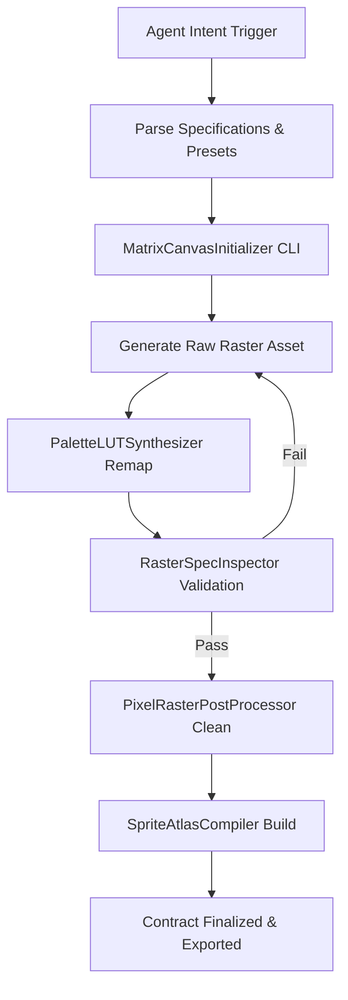

# PixelMatrix Engine — Pipeline Execution Protocol

Step-by-step autonomous execution protocol for AI Agents (Claude Code, OpenAI Codex, Antigravity IDE).

---

## Autonomous Execution Protocol



---

## Step 1: Workspace & Contract Setup
Run `canvas_initializer.py` to initialize workspace directories and generate the contract specification:
```bash
python3 skills/pixelmatrix-engine/scripts/canvas_initializer.py \
  --workspace ./ \
  --asset-name hero_knight \
  --preset standard_sprite_32 \
  --palette pico8_fantasy_16 \
  --matrix character_4way_matrix \
  --json
```

---

## Step 2: Quality Inspection & Validation
Validate the raw raster against canvas grid alignment, color limits, anti-aliasing artifacts, and orphan pixels:
```bash
python3 skills/pixelmatrix-engine/scripts/spec_inspector.py \
  --image source_rasters/hero_knight_raw.png \
  --width 32 \
  --height 32 \
  --max-colors 16 \
  --json
```

---

## Step 3: Post-Processing & Indexed PNG Quantization
Clean anti-aliasing artifacts, purge isolated orphan pixels, and export 8-bit indexed PNG:
```bash
python3 skills/pixelmatrix-engine/scripts/raster_processor.py \
  --input source_rasters/hero_knight_raw.png \
  --output exports/indexed_png/hero_knight_indexed.png \
  --max-colors 16 \
  --json
```

---

## Step 4: Atlas Packing & Metadata Compilation
Compile individual frames into a grid texture atlas with JSON metadata manifest:
```bash
python3 skills/pixelmatrix-engine/scripts/atlas_compiler.py \
  --frames-dir source_rasters/hero_knight_frames/ \
  --output compiled_atlases/hero_knight_atlas.png \
  --width 32 \
  --height 32 \
  --json
```
